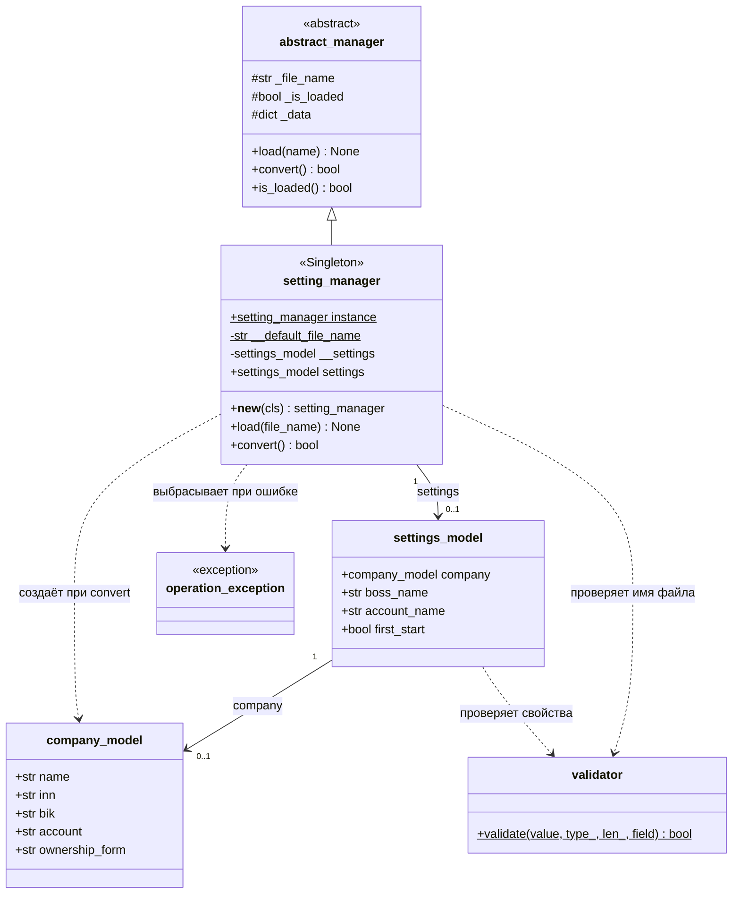
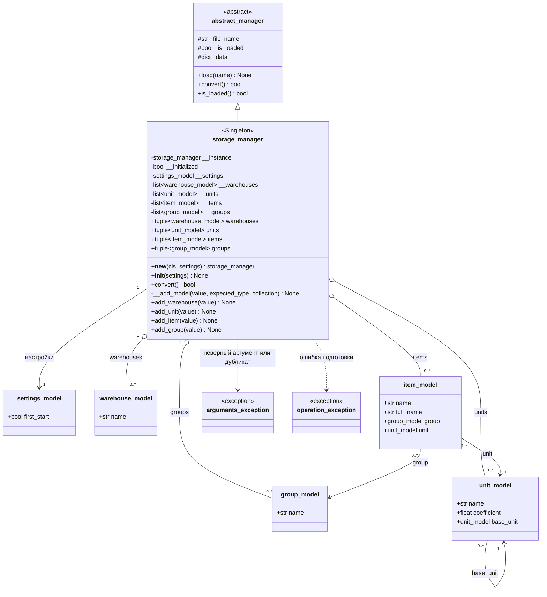

# UML-диаграммы менеджеров
Обозначения: `+` — публичный член, `#` — защищённый, `-` — приватный; `$` — член класса. Свойства Python показаны как атрибуты. Стрелка с треугольником означает наследование, пунктирная — зависимость, пустой ромб — хранение ссылок на объекты без исключительного владения ими.

## Менеджер настроек

`load()` читает JSON в `_data`, затем вызывает `convert()`. Метод `convert()` создаёт организацию и настройки, включая `first_start`, и публикует модель только после успешного заполнения. До первого успешного преобразования настройки могут отсутствовать.

## Менеджер хранилища

Для читаемости у доменных моделей показаны только связанные с хранилищем свойства, включая унаследованное `name`. Все четыре модели также имеют унаследованный `unique_code`. Тип `coefficient` в коде — `int | float`; в диаграмме он сокращён до `float`. Коллекции возвращаются как кортежи произвольной длины.

### Первый старт и повторные обращения

- Конструктор принимает готовую `settings_model` и вызывает `convert()` при первой инициализации.
- При `first_start = True` создаются группа «Бакалея», грамм, килограмм с коэффициентом 1000, «Основной склад» и номенклатура «Мука». Мука ссылается на общую группу и килограмм; грамм ссылается на себя как базовую единицу.
- При `first_start = False` коллекции остаются пустыми, подготовка завершается успешно.
- Повторное создание Singleton сохраняет данные. Повторный `convert()` после успешной подготовки возвращает `True` без пересоздания объектов.
- Методы добавления проверяют тип и совпадение `unique_code` среди всех четырёх коллекций. Для номенклатуры проверяется регистрация группы и единицы; для производной единицы — регистрация базовой.

`abstract_manager` наследует `ABC`, но его методы пока не помечены `@abstractmethod`. Обозначение `abstract` отражает назначение базового класса. Унаследованный `load()` в `storage_manager` не переопределён и остаётся заглушкой.
