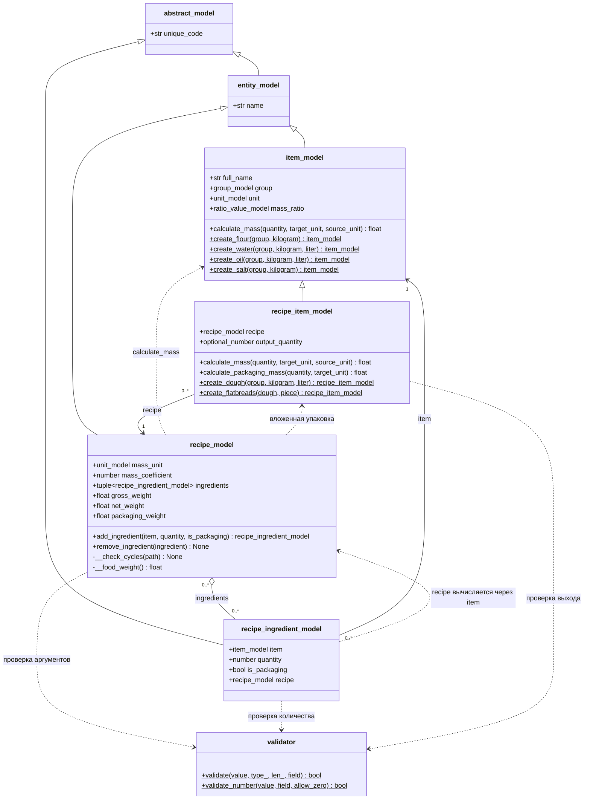
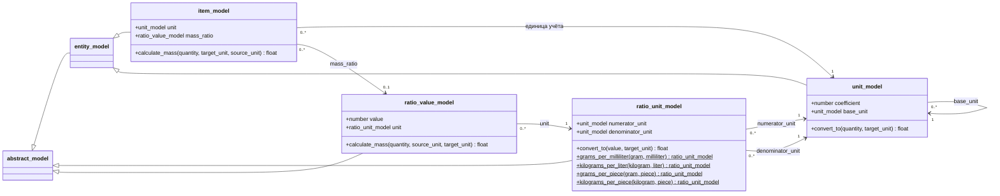

# UML-диаграммы моделей технологических карт

Диаграммы описывают текущую реализацию в `Src/Models`.
Обозначения: `+` — публичный член, `-` — приватный, `$` — статический метод.
Свойства Python показаны как атрибуты. `number` сокращает `int | float`,
`optional_number` — `int | float | None`. Треугольник обозначает наследование,
пустой ромб — хранение ссылок без исключительного владения, пунктир — зависимость.

## Продукт, карта и строка состава



### Ответственность моделей

- **`item_model`** хранит характеристики обычного продукта и рассчитывает массу
  через перевод единиц или `mass_ratio`.
- **`recipe_item_model`** наследует номенклатуру и связывает составной продукт
  с его картой. При заданном `output_quantity` вычисляет долю нетто партии;
  без него количество означает готовую массу весового продукта.
- **`recipe_ingredient_model`** хранит количество и назначение продукта
  в конкретной карте. `item` и `is_packaging` доступны только для чтения,
  `quantity` изменяется через валидируемый сеттер. Свойство `recipe` возвращает
  карту составного продукта либо `None`, отдельная ссылка не хранится.
- **`recipe_model`** управляет составом, проверяет циклы до добавления строки
  и вычисляет итоговые массы. `add_ingredient()` создаёт и возвращает строку;
  также допускается передача готовой строки.

Один продукт может использоваться во многих строках. Текущая реализация
позволяет передать одну строку в разные карты, поэтому связь карты со строками
показана агрегацией, а не исключительным владением. Повторное добавление той же
строки в одну карту запрещено. Удаление выполняется по идентичности строки.

Ссылка `recipe_item_model.recipe` доступна только для чтения. Проверка циклов
обходит текущий путь вложенных карт: прямые и косвенные циклы запрещены,
общий полуфабрикат в разных ветках разрешён.

### Расчёт массы

Все массы карты выражаются в её `mass_unit`:

```text
Входная пищевая масса = сумма масс строк, не помеченных упаковкой
Брутто = входная пищевая масса + упаковка
Нетто = входная пищевая масса × коэффициент выхода
```

Масса пищевой строки составного продукта берётся из готового нетто вложенной
карты с учётом доли партии либо из заданного количества готового весового
продукта. Упаковка вложенных карт переносится отдельно и не умножается на
коэффициент обработки. Брутто текущей карты не является суммарным расходом
исходного сырья по всей цепочке производства.

Массы вычисляются при обращении к свойствам. Изменение количества, добавление
и удаление строк не требуют отдельного обновления сумм.

## Единицы и характеристики массы



`mass_ratio` необязателен: для муки достаточно перевода кг в г, для воды
и масла применяется плотность, для упаковки в штуках — масса одной штуки.
Совместимость определяется базовыми единицами справочника, а не названиями.
Физический вид величины отдельно не хранится: корректную единицу массы
передаёт вызывающий код.

